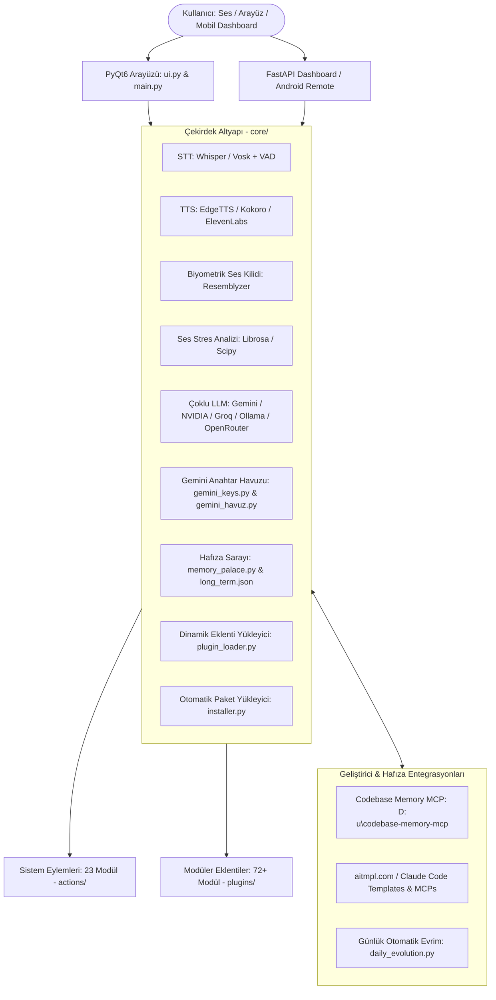

# JARVIS (Just A Rather Very Intelligent System) - Kapsamlı Kurulum ve Sistem Dokümantasyonu

Bu belge, **JARVIS** yapay zeka asistanının tüm mimarisini, çekirdek modüllerini, 23 sistem eylemini, 72+ eklentisini, ses motorlarını, çoklu LLM altyapısını, `codebase-memory-mcp` grafik hafıza entegrasyonunu, `aitmpl.com` şablonlarını ve sıfırdan adım adım kurulum yönergelerini içermektedir.

---

## 1. Sistem Mimarisi ve Bileşenler Haritası

JARVIS; canlı sesli görüşme (Gemini Live), çoklu yapay zeka sağlayıcıları, bilgisayarlı görü, masaüstü/sistem otomasyonu, uzaktan kumanda paneli, yerel veritabanı/hafıza sarayı ve kendi kendini geliştiren (*self-evolution*) modüler bir yapay zeka işletim katmanıdır.



---

## 2. Dizin ve Dosya Mimarisi Detayı

### A. Kök Dizin Dosyaları
* **`main.py`**: Ana asistan döngüsü, Gemini Live WebSocket oturumu, ses kaydı, klavye kısayolları ve eylem yönlendirmesi.
* **`ui.py`**: PyQt6 tabanlı, fütüristik ses dalgası vizüalizörü, durum göstergeleri, log konsolu ve kontrol paneli.
* **`requirements.txt`**: Tüm Python bağımlılıklarının listesi.
* **`setup.py`**: Bağımlılıkların ve Playwright tarayıcılarının otomatik kurulum betiği.
* **`add_provider_key.py`**: API anahtarlarını güvenli biçimde ekleme yardımcı aracı.
* **`enroll_voice.py` & `test_voice_id.py`**: Biyometrik ses kaydı alma ve doğrulama araçları.
* **`daily_evolution.py`**: Kendi kendine kod analizi, yeni eklenti üretimi ve Git senkronizasyonu.
* **`gemini_havuz.py`**: Çoklu Gemini API anahtarlarının kota kontrolü ve rotasyonu.
* **`start_jarvis.bat` / `gunluk_evrim_kur.bat` / `gunluk_evrim_calistir.bat`**: Windows hızlı başlatma ve Görev Zamanlayıcı betikleri.

---

### B. Çekirdek Modüller (`core/`)
| Modül | Görevi |
| :--- | :--- |
| **`llm_client.py`** | Gemini, OpenRouter, Groq, Cerebras, NVIDIA AI, Ollama ve LM Studio ile çoklu LLM istemcisi. |
| **`gemini_keys.py`** | Gemini API anahtarları arasında yük dengeleme ve kota aşımında otomatik geçiş. |
| **`stt.py`** | Whisper ve Vosk modelleriyle mikrofon sesini metne dönüştürme ve WebRTC VAD ses algılama. |
| **`tts.py`** | Microsoft Edge TTS (online), Kokoro (çevrimdışı nöral ses) ve ElevenLabs ses sentezi. |
| **`voice_id.py`** | Resemblyzer ile konuşmacı gömme vektörü (*speaker embedding*) çıkarıp yetkisiz sesleri filtreleme. |
| **`voice_tension.py`** | Kullanıcının ses tonundaki stres ve gerilim seviyesini tespit etme. |
| **`memory_palace.py`** | Kullanıcı tercihlerini, konuşma geçmişlerini ve bağlamı hafıza sarayında organize etme. |
| **`plugin_loader.py`** | `plugins/` altındaki eklentileri çalışma anında dinamik olarak yükleme ve doğrulama. |
| **`installer.py`** | Eksik Python paketlerini otomatik olarak tespit edip pip üzerinden yükleme. |
| **`api_usage.py`** | Token ve API çağrı limitlerini gerçek zamanlı takip etme. |
| **`agents.py`** | Alt görevleri uzman ajanlara paylaştırma motoru. |

---

### C. Sistem Eylemleri (`actions/` - 23 Eylem Modülü)
1. **`browser_control.py`**: Playwright ile tam otonom tarayıcı kontrolü, web araması, buton tıklama ve form doldurma.
2. **`computer_control.py` & `computer_settings.py`**: Windows ses seviyesi, parlaklık, çözünürlük, pencere konumlandırma ve kilit kontrolü.
3. **`desktop.py`**: Masaüstü simgeleri, düzenleme ve dosya yönetimi.
4. **`dev_agent.py` & `code_helper.py`**: Kod geliştirme, test çalıştırma, hata ayıklama ve dosya refactoring.
5. **`file_controller.py` & `file_processor.py`**: PDF, Word, Excel, PowerPoint okuma, dönüştürme ve özetleme.
6. **`calorie_counter.py` & `pushup_counter.py`**: OpenCV ile kamera üzerinden şınav ve yemek kalori analizi.
7. **`system_monitor.py` & `background_monitor.py`**: CPU, RAM, GPU, disk, sıcaklık ve arka plan servis izleme.
8. **`flight_finder.py`**: Uçuş fiyatları ve sefer sorgulama.
9. **`game_updater.py`**: Steam ve Epic Games kütüphane/güncelleme kontrolü.
10. **`open_app.py`**: Uygulama ve program başlatma/kapatma.
11. **`reminder.py`**: Sesli ve bildirimli hatırlatıcı sistemi.
12. **`screen_processor.py`**: Ekran görüntüsü yakalama ve görsel modelle analiz etme.
13. **`send_message.py`**: WhatsApp ve Telegram üzerinden mesaj iletme.
14. **`upload_video.py` & `youtube_video.py`**: YouTube video arama, transkript çekme ve medya işlemleri.
15. **`weather_report.py`**: Anlık ve haftalık hava durumu raporlama.
16. **`web_search.py`**: DuckDuckGo ve Gemini destekli gerçek zamanlı arama.
17. **`proactive.py`**: Kullanıcıya belirli aralıklarla proaktif durum bildirimleri iletme.

---

### D. Modüler Eklentiler (`plugins/` - 72+ Eklenti)
* **Ofis ve Belge Otomasyonu:** `excel_reader`, `excel_writer`, `excel_modifier`, `excel_merge_cleaner`, `excel_formula_helper`, `document_ocr`, `document_extractor`, `document_processor`.
* **Finans ve Borsa:** `bist_market_watch`, `market_data`.
* **NVIDIA AI ve Vision:** `nvidia_ai_api_fetcher`, `nvidia_free_endpoint`, `nvidia_integrate_api`, `nvidia_model_query`, `nvidia_vision_api`.
* **Ağ ve Güvenlik:** `network_scanner`, `network_data_fetcher`, `privacy_security_manager`, `privacy_security_regulation`, `log_watcher`, `syncthing_status`, `device_manager`.
* **İletişim ve Mesajlaşma:** `whatsapp_reader`, `whatsapp_backup`, `telegram_notify`, `calendar_manager`.
* **Medya ve Donanım:** `binaural_audio`, `visual_editing`, `background_removal`, `printer_control`, `scanner_control`.
* **Kendi Kendini Geliştirme (Self-Improvement):** `self_evolution.py`, `self_improve.py`, `self_improvement_program.py`, `trend_based_roadmap.py`, `internet_research_self_improve.py`, `codebase_intelligence.py`.
* **Doğrulama ve Test:** `app_launch_verifier`, `app_verification`, `app_verification_ocr`, `app_verification_screenshot`, `app_website_verifier`.

---

### E. Uzaktan Erişim & Dashboard (`dashboard/` & `android-remote/`)
* **FastAPI Web Server (`dashboard/server.py`):** `http://localhost:47291` portunda çalışır. WebSockets üzerinden anlık ses transferi, komut iletimi ve sistem durumunu telefona aktarır.
* **Android Remote:** Android cihazlar için geliştirilmiş yerel kontrol uygulaması.

---

## 3. Sistem Gereksinimleri

### Temel Gereksinimler
* **İşletim Sistemi:** Windows 10/11 (64-bit) (Tavsiye edilen), macOS veya Linux.
* **Python:** Python 3.11 veya 3.12 (64-bit).
* **Donanım:** Mikrofon, hoparlör veya kulaklık.
* **İnternet:** Gemini API ve online servisler için internet bağlantısı.
* **API Anahtarı:** En az 1 adet Google Gemini API anahtarı.

### İsteğe Bağlı Donanım & Yazılımlar
* **Kamera:** Şınav sayacı, yemek/kalori analizi ve ekran/kamera farkındalığı için.
* **Node.js (v18+) & NPM:** `aitmpl`, Claude Code Templates ve MCP sunucuları için.
* **Git:** Günlük evrim (*Daily Evolution*) ve GitHub commit senkronizasyonu için.
* **Ollama veya LM Studio:** Tamamen çevrimdışı yerel metin üretimi için.
* **NVIDIA GPU (CUDA):** Kokoro TTS veya yerel dil modellerinin GPU hızlandırması için.

---

## 4. Sıfırdan Adım Adım Kurulum Rehberi

### Adım 1: Proje Dizinini Açma ve Sanal Ortamı (.venv) Hazırlama

PowerShell terminalini açın ve proje dizinine gidin:

```powershell
cd D:\nu\JARVIS

# Python 3.11 ile sanal ortam oluşturun
py -3.11 -m venv .venv

# Sanal ortamı etkinleştirin
.\.venv\Scripts\Activate.ps1
```

> [!NOTE]
> PowerShell betik çalıştırma engeli verirse şu komutu çalıştırın:
> `Set-ExecutionPolicy -Scope CurrentUser RemoteSigned`

---

### Adım 2: Bağımlılıkları Yükleme

Pip aracını güncelleyin ve `requirements.txt` dosyasındaki paketleri kurun:

```powershell
python -m pip install --upgrade pip
python -m pip install -r requirements.txt
```

Web otomasyonu ve tarayıcı işlemleri için Playwright Chromium bileşenini yükleyin:

```powershell
python -m playwright install chromium
```

---

### Adım 3: API Anahtarlarını Yapılandırma

JARVIS'in anahtar dosyası **`config/api_keys.json`** dosyasında saklanır. Anahtarlarınızı interaktif ve güvenli şekilde eklemek için:

```powershell
.\.venv\Scripts\python.exe add_provider_key.py
```
*(Menüden **4) Gemini** seçeneğini kullanarak Google AI Studio anahtarınızı girin).*

Alternatif olarak `config/api_keys.json` dosyasını doğrudan düzenleyebilirsiniz:

```json
{
  "gemini_api_key": "YOUR_GEMINI_API_KEY",
  "os_system": "windows",
  "assistant_name": "JARVIS",
  "user_name": "Efendim",
  "stt_engine": "whisper",
  "tts_engine": "edgetts",
  "morning_brief_enabled": true,
  "plugins_enabled": {}
}
```

> [!TIP]
> **Yedek LLM Sağlayıcıları:** Gemini kotası dolduğunda otomatik devreye girmesi için `groq_api_key`, `openrouter_api_key`, `cerebras_api_key` veya `nvidia_api_key` alanlarını ekleyebilirsiniz.

---

### Adım 4: Codebase Memory MCP (`D:\nu\codebase-memory-mcp`) Entegrasyonu

JARVIS'in tüm kod tabanını bilgi grafiği (*knowledge graph*) olarak belleğinde tutması için `codebase-memory-mcp` kurulmuştur.

* **Yürütülebilir Dosya:** `D:\nu\codebase-memory-mcp\codebase-memory-mcp.exe`
* **Çalışma Alanı Yapılandırması:** [`.agents/mcp_config.json`](file:///d:/nu/JARVIS/.agents/mcp_config.json)
* **Global Yapılandırma:** `~/.gemini/config/mcp_config.json`

```json
{
  "mcpServers": {
    "codebase-memory-mcp": {
      "command": "C:/Users/Osman Aran/AppData/Local/Programs/codebase-memory-mcp/codebase-memory-mcp.exe",
      "args": []
    }
  }
}
```

**Kullanılan Temel Grafik Araçları:**
* `search_graph`: Fonksiyon, sınıf ve değişkenleri semantik arar.
* `trace_path`: Fonksiyon çağrı yönlerini ve bağımlılık zincirini inceler.
* `get_code_snippet`: Doğrudan hedef sembolün kaynak kodunu çeker.
* `get_architecture`: Proje genel mimari özetini sağlar.

---

### Adım 5: aitmpl.com & Ek MCP Sunucularının Kurulumu

`aitmpl.com` (Claude Code Templates) ekosistemindeki hazır ajan ve araçları projeye dahil etmek için:

```powershell
# aitmpl CLI aracını yükleyin
npm install -g claude-code-templates

# Temel MCP sunucularını yükleyin
npm install -g @modelcontextprotocol/server-filesystem @modelcontextprotocol/server-memory @modelcontextprotocol/server-brave-search @modelcontextprotocol/server-puppeteer
```

---

## 5. Ses Motorları ve Biyometrik Ses Kilidi

### 1. Biyometrik Ses Profili Tanımlama (Ses Kilidi)
JARVIS'in yalnızca sizin sesinize tepki vermesi için mikrofona yaklaşık 8 saniye konuşarak profil oluşturun:

```powershell
.\.venv\Scripts\python.exe enroll_voice.py
```
Profil `config/voice_id.npy` dosyasına kaydedilir. Profil eşleşmesini test etmek için:
```powershell
.\.venv\Scripts\python.exe test_voice_id.py
```

### 2. STT (Konuşmayı Metne Çevirme)
* **Whisper (Varsayılan):** Çevrimdışı ve yüksek doğruluklu. `config/api_keys.json` içine `"stt_engine": "whisper"`.
* **Vosk (Düşük Kaynaklı Çevrimdışı):** `pip install vosk` ve `"stt_engine": "vosk"`.

### 3. TTS (Metni Sese Çevirme)
* **Microsoft Edge TTS (Varsayılan):** Ücretsiz ve çok doğal Türkçe sesler (`"tts_engine": "edgetts"`).
* **Kokoro TTS (Tamamen Çevrimdışı & Yüksek Kalite):**
  ```powershell
  pip install "kokoro>=0.9" soundfile
  ```
  `config/api_keys.json` içine `"tts_engine": "kokoro"`.
* **ElevenLabs (Stüdyo Kalitesi):**
  `config/api_keys.json` içine `"tts_engine": "elevenlabs"`, `"elevenlabs_api_key": "..."`, `"elevenlabs_voice_id": "..."`.

---

## 6. Yerel LLM Entegrasyonu (Ollama & LM Studio)

İnternet bağlantısı olmadan yerel modellerle çalışmak için:

### Ollama Kurulumu:
1. [ollama.com](https://ollama.com) üzerinden Ollama'yı kurun.
2. Modeli indirin: `ollama pull llama3.2` veya `ollama pull qwen2.5-coder`.
3. `config/api_keys.json` dosyasına ekleyin:
   ```json
   {
     "llm_provider": "ollama",
     "llm_url": "http://localhost:11434",
     "llm_model": "llama3.2"
   }
   ```

---

## 7. Mobil / Telefon Uzaktan Kumandası (Dashboard)

1. JARVIS'i başlatın.
2. Arayüzün sağ altındaki **REMOTE CONTROL** butonuna tıklayın.
3. Ekranda beliren QR kodu telefonunuzla tarayın veya tarayıcıda `http://<BILGISAYAR_IP>:47291` adresini açın.
4. *Telefon ve bilgisayar aynı Wi-Fi ağında olmalıdır.*

---

## 8. Günlük Otomatik Evrim (Daily Evolution)

JARVIS'in her gün kendi kod tabanını inceleyip eksiklikleri tespit etmesi, yeni eklentiler üretmesi ve bunları Git üzerinden doğrulaması için:

1. **Elle Test:**
   ```powershell
   .\.venv\Scripts\python.exe daily_evolution.py
   ```
2. **Windows Görev Zamanlayıcı'ya Ekleme (Her Sabah 09:00):**
   ```powershell
   .\gunluk_evrim_kur.bat
   ```
3. **Logları İnceleme:** Süreç `evolution.log` dosyasına kaydedilir.

---

## 9. JARVIS'i Başlatma

Kurulumlar tamamlandıktan sonra asistanı çalıştırmak için:

### Normal / Görsel Arayüz ile Başlatma:
```powershell
python main.py
```

### Arka Planda / Sessiz Başlatma:
```powershell
.\start_jarvis.bat
```

---

## 10. Sık Karşılaşılan Sorunlar ve Çözümler

| Hata / Durum | Neden | Çözüm |
| :--- | :--- | :--- |
| `No Python at '...'` | Sanal ortam Python yolu taşınmış/bozulmuş | `.venv` klasörünü silin ve `py -3.11 -m venv .venv` ile yeniden kurun. |
| `ModuleNotFoundError` | Paketler sanal ortama yüklenmemiş | `.\.venv\Scripts\Activate.ps1` ardından `pip install -r requirements.txt` çalıştırın. |
| `Playwright Browser not found` | Chromium ikilisi indirilmemiş | `python -m playwright install chromium` komutunu çalıştırın. |
| Mikrofon / Kamera Algılanmıyor | Windows gizlilik izinleri kapalı | Windows Ayarları > Gizlilik > Mikrofon/Kamera izinlerini aktif edin. |
| Dashboard Açılmıyor | Güvenlik duvarı engeli | Windows Güvenlik Duvarı'nda TCP `47291` portuna izin verin. |
| Kota / 429 Hatası | Gemini günlük kotası doldu | `add_provider_key.py` ile yedek Groq / OpenRouter anahtarı tanımlayın. |
| Ses Kilidi Yanıt Vermiyor | Ses eşiği düşük veya profil eski | `enroll_voice.py` ile yeni bir ses kaydı alın. |

---

## 11. Güvenlik ve Gizlilik Prensipleri
* `config/api_keys.json`, `config/voice_id.npy`, `memory/long_term.json` ve `evolution.log` dosyalarını asla genel depolarda (GitHub) paylaşmayın.
* Bu dosyalar varsayılan olarak `.gitignore` listesindedir.

---

## 12. Otonom Yüklü MCP Sunucuları ve Self-Installer Sistemi

JARVIS'e harici araç entegrasyonlarını yapabilmesi ve gelecekteki bileşenleri **kendi kendine kurabilmesi** için aşağıdaki altyapı eklenmiştir:

### Yüklü ve Aktif MCP Sunucuları (`.agents/mcp_config.json`):
1. **`codebase-memory-mcp`**: Kod tabanının semantik grafik hafızası (`D:\nu\codebase-memory-mcp\codebase-memory-mcp.exe`).
2. **`filesystem`**: Güvenli yerel dosya arama ve düzenleme sunucusu (`@modelcontextprotocol/server-filesystem`).
3. **`memory`**: Uzun vadeli bağlamsal bilgi grafiği (`@modelcontextprotocol/server-memory`).
4. **`puppeteer`**: Otonom web tarayıcısı ve ekran yakalayıcı (`@modelcontextprotocol/server-puppeteer`).
5. **`brave-search`**: Gerçek zamanlı internet arama motoru (`@modelcontextprotocol/server-brave-search`).

### JARVIS Otonom Kurulum Modülleri:
* **`core/mcp_manager.py`**: MCP sunucularını, Python kütüphanelerini ve aitmpl şablonlarını arka planda otomatik kuran, `mcp_config.json` dosyasına kaydeden ve `kurulum.md` belgesini otomatik güncelleyen çekirdek yönetici.
* **`plugins/mcp_aitmpl_installer.py`**: JARVIS'in sesli komutla veya yapay zeka aracılığıyla (`install_mcp`, `install_python`, `list_mcps`, `register_existing`) yeni araçları kendi kendine kurmasını sağlayan eklenti.

---

## 13. İleri Düzey Vektörel Hafıza, Bilgisayarlı Görü ve Medya Stüdyosu

JARVIS'e eklenen yeni nesil yetenekler ve eklentiler:

### 1. Vektörel Hafıza & Belge RAG Sistemi
* **Kütüphaneler:** `chromadb`, `lancedb`
* **Eklenti:** [`plugins/vector_memory_rag.py`](file:///d:/nu/JARVIS/plugins/vector_memory_rag.py)
* **Kullanım:** Belge, kod veya notları anlamsal vektör uzayına kaydeder ve semantik aramayla en doğru bilgiyi anında geri getirir.

### 2. Bilgisayarlı Görü & El Hareketi Takibi (Vision & Gestures)
* **Kütüphaneler:** `mediapipe`, `ultralytics` (YOLOv11), `opencv-python`
* **Eklenti:** [`plugins/gesture_control.py`](file:///d:/nu/JARVIS/plugins/gesture_control.py)
* **Kullanım:** Kamera üzerinden el hareketlerini (el sallama, işaret etme, parmak şıklatma) algılayarak ses çıkarmadan masaüstünü ve medyayı kontrol eder.

### 3. Medya, Ses ve Video İşleme Stüdyosu
* **Kütüphaneler:** `moviepy`, `ffmpeg-python`
* **Eklenti:** [`plugins/media_studio.py`](file:///d:/nu/JARVIS/plugins/media_studio.py)
* **Kullanım:** Video kırpma, saniyeler içinde ses ayrıştırma, format dönüştürme ve medya optimizasyonu.

### 4. Çok Kanallı Bot Köprüsü (Discord & Slack)
* **Kütüphaneler:** `discord.py`, `slack-sdk`
* **Kullanım:** JARVIS'in Discord ve Slack üzerinden uzaktan bildirim göndermesini ve komut almasını sağlar.


### 📦 Yeni Eklenen Bileşen: Python: pip
- **Tür:** Python Kütüphanesi
- **Açıklama:** JARVIS tarafından otonom kurulan pip paketi.
- **Kurulum Komutu:**
```powershell
pip install pip
```
