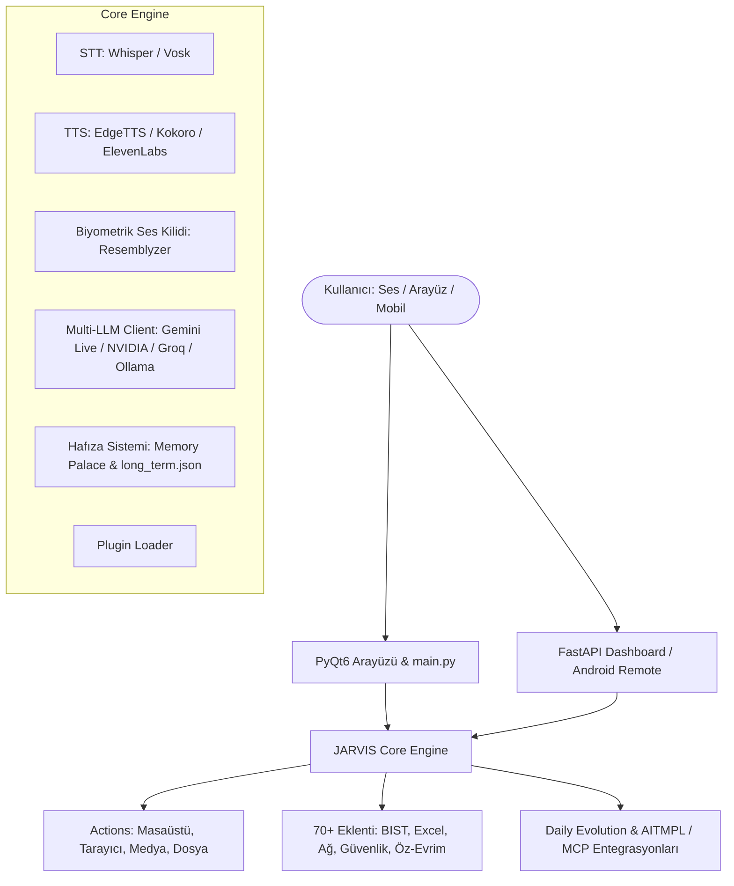

# JARVIS (Just A Rather Very Intelligent System) - Kapsamlı Kurulum ve Sistem Rehberi

Bu belge, **JARVIS** yapay zeka asistanının tüm mimarisini, bileşenlerini, eklentilerini, gereksinimlerini ve adım adım kurulum yönergelerini içermektedir.

---

## 1. Sistem Mimarisi ve Genel Bakış

JARVIS; ses tanıma, gelişmiş dil modelleri, bilgisayarlı görü, masaüstü/sistem otomasyonu, uzaktan kumanda dashboard'u ve kendi kendini geliştirme (*self-evolution*) yeteneklerine sahip modüler bir yapay zeka asistanıdır.



### Proje Dizin Yapısı

* **`main.py`**: Ana asistan döngüsü, canlı ses iletişimi, araç yönetimi ve olay koordinatörü.
* **`ui.py`**: PyQt6 tabanlı modern ve animasyonlu masaüstü arayüzü.
* **`core/`**: Çekirdek motorlar:
  * `llm_client.py`: Çoklu LLM istemcisi (Gemini, OpenRouter, Groq, Cerebras, Ollama, LM Studio).
  * `gemini_keys.py` & `gemini_havuz.py`: Çoklu Gemini API anahtarı havuzu ve kota rotasyonu.
  * `stt.py` & `tts.py`: Konuşma tanıma (STT) ve ses sentezi (TTS).
  * `voice_id.py`: Resemblyzer ile kullanıcı ses profili çıkarma ve ses kilidi.
  * `voice_tension.py`: Ses frekans analizi ve stres tespiti.
  * `memory_palace.py` & `api_usage.py`: Hafıza sarayı ve API kullanım/kota takibi.
  * `plugin_loader.py` & `installer.py`: Dinamik eklenti ve bağımlılık yöneticisi.
* **`actions/`** (23 Sistem Eylemi):
  * `browser_control.py`: Playwright ile tarayıcı gezintisi ve web otomasyonu.
  * `computer_control.py` & `computer_settings.py`: Windows sistem, ses, ekran, pencere kontrolü.
  * `desktop.py` & `file_controller.py`: Masaüstü ve dosya işlemleri.
  * `calorie_counter.py` & `pushup_counter.py`: Bilgisayarlı görü (OpenCV) ile spor ve kalori takibi.
  * `code_helper.py` & `dev_agent.py`: Kod yazma, test ve analiz ajanları.
  * `system_monitor.py` & `background_monitor.py`: CPU, RAM, disk, sıcaklık izleme.
* **`plugins/`** (72+ Modüler Eklenti):
  * Excel ve ofis otomasyonları (`excel_reader`, `excel_writer`, `document_ocr` vb.).
  * Piyasa, döviz ve BIST takibi (`bist_market_watch`, `market_data`).
  * NVIDIA AI & Vision API entegrasyonları.
  * Güvenlik, gizlilik ve ağ analiz araçları (`network_scanner`, `privacy_security_manager`).
  * WhatsApp yerel arşiv okuyucu ve Telegram bildirim eklentisi.
  * Öz-geliştirme ve günlük evrim (`self_evolution.py`, `self_improve.py`).
* **`dashboard/`**: FastAPI ve WebSocket tabanlı uzaktan kontrol sunucusu (`http://localhost:47291`).
* **`android-remote/`**: Android cihazlar için uzaktan kumanda kaynak kodları.
* **`daily_evolution.py`**: Günlük otomatik kod analizi, eklenti üretimi ve Git senkronizasyonu.

---

## 2. Sistem Gereksinimleri

### Zorunlu Gereksinimler
* **İşletim Sistemi**: Windows 10/11 (Önerilen), macOS veya Linux.
* **Python**: Python 3.11 veya 3.12 (64-bit).
* **Donanım**: Mikrofon, hoparlör/kulaklık.
* **İnternet**: Gemini API ve online servisler için aktif internet bağlantısı.
* **API Anahtarı**: En az bir adet Google Gemini API anahtarı.

### İsteğe Bağlı Donanım ve Yazılımlar
* **Kamera**: Ekran/kamera farkındalığı, kalori ve şınav sayacı için.
* **Node.js (v18+) & NPM**: aitmpl, Claude Code Templates ve MCP sunucuları için.
* **Git**: Günlük evrim (*Daily Evolution*) ve GitHub otomatik senkronizasyonu için.
* **Yerel LLM (Ollama / LM Studio)**: Çevrimdışı metin zekası için.
* **NVIDIA GPU (CUDA)**: Kokoro TTS veya yerel modellerin ultra hızlı çalışması için.

---

## 3. Sıfırdan Adım Adım Kurulum

### Adım 1: Proje Dizinine Geçiş ve Sanal Ortam Oluşturma

PowerShell'i yönetici veya kullanıcı yetkisiyle açın:

```powershell
cd D:\nu\JARVIS

# Python 3.11 ile sanal ortam oluşturun
py -3.11 -m venv .venv

# Sanal ortamı etkinleştirin
.\.venv\Scripts\Activate.ps1
```

> [!NOTE]
> PowerShell betik çalıştırma engeli verirse şu komutu çalıştırın:
> `Set-ExecutionPolicy -Scope CurrentUser RemoteSigned`

---

### Adım 2: Python Paketlerinin Yüklenmesi

Pip'i güncelleyin ve `requirements.txt` dosyasındaki tüm kütüphaneleri kurun:

```powershell
python -m pip install --upgrade pip
python -m pip install -r requirements.txt
```

Web otomasyonu için Playwright Chromium tarayıcısını yükleyin:

```powershell
python -m playwright install chromium
```

---

### Adım 3: API Anahtarlarının Yapılandırılması

JARVIS API ayarlarını `config/api_keys.json` dosyasında saklar. Güvenli anahtar eklemek için yardımcı aracı çalıştırın:

```powershell
.\.venv\Scripts\python.exe add_provider_key.py
```

Menüden ilgili sağlayıcıyı seçin (örneğin **4) Gemini**).

Alternatif olarak `config/api_keys.json` dosyasını elle düzenleyebilirsiniz:

```json
{
  "gemini_api_key": "YOUR_GEMINI_API_KEY",
  "os_system": "windows",
  "assistant_name": "JARVIS",
  "user_name": "Efendim",
  "stt_engine": "whisper",
  "tts_engine": "edgetts",
  "morning_brief_enabled": true,
  "plugins_enabled": {}
}
```

> [!TIP]
> **Yedek Sağlayıcılar:** İsteğe bağlı olarak `openrouter_api_key`, `groq_api_key`, `cerebras_api_key` veya `nvidia_api_key` ekleyerek Gemini kotası dolduğunda kesintisiz çalışmasını sağlayabilirsiniz.

---

### Adım 4: aitmpl ve MCP (Model Context Protocol) Kurulumu

`aitmpl.com` üzerindeki araçları, ajanları ve MCP sunucularını projeye dahil etmek için:

```powershell
# aitmpl / Claude Code Templates CLI kurulumu
npm install -g claude-code-templates

# Temel MCP Sunucularının Yüklenmesi
npm install -g @modelcontextprotocol/server-filesystem @modelcontextprotocol/server-memory @modelcontextprotocol/server-brave-search @modelcontextprotocol/server-puppeteer
```

---

## 4. Ses Motorları ve Biyometrik Ses Kilidi

### 1. Biyometrik Ses Profili (Ses Kilidi - İsteğe Bağlı)
JARVIS'in sadece sizin sesinize yanıt vermesini istiyorsanız:

```powershell
.\.venv\Scripts\python.exe enroll_voice.py
```
*Mikrofona yaklaşık 8 saniye doğal konuşun. Profil `config/voice_id.npy` içine kaydedilir.*

Test etmek için:
```powershell
.\.venv\Scripts\python.exe test_voice_id.py
```

### 2. Konuşma Tanıma (STT) Motorları
* **Whisper (Varsayılan - Çevrimdışı/Hızlı):** `requirements.txt` ile otomatik hazır gelir.
* **Vosk (Alternatif Çevrimdışı):** `pip install vosk` ve `config/api_keys.json` içine `"stt_engine": "vosk"`.

### 3. Ses Sentezi (TTS) Motorları
* **Microsoft Edge TTS (Varsayılan - Çok Doğal & Ücretsiz):** İnternet gerektirir (`"tts_engine": "edgetts"`).
* **Kokoro TTS (Tamamen Çevrimdışı & Yüksek Kalite):**
  ```powershell
  pip install "kokoro>=0.9" soundfile
  ```
  `config/api_keys.json` içine `"tts_engine": "kokoro"`.
* **ElevenLabs (Premium Stüdyo Sesi):**
  `config/api_keys.json` içine `"tts_engine": "elevenlabs"`, `"elevenlabs_api_key": "..."`, `"elevenlabs_voice_id": "..."`.

---

## 5. Yerel LLM Entegrasyonu (Ollama & LM Studio)

İnternet olmadan veya yerel açık kaynaklı modellerle metin işlemek için:

### Ollama Kurulumu
1. [ollama.com](https://ollama.com) adresinden Ollama'yı kurun.
2. Modeli indirin: `ollama pull llama3.2` veya `ollama pull qwen2.5-coder`.
3. `config/api_keys.json` içine ekleyin:
   ```json
   {
     "llm_provider": "ollama",
     "llm_url": "http://localhost:11434",
     "llm_model": "llama3.2"
   }
   ```

---

## 6. Telefon ve Mobil Uzaktan Kumanda (Dashboard)

1. JARVIS'i başlatın ve arayüzdeki **REMOTE CONTROL** butonuna tıklayın.
2. Açılan QR kodu telefonunuzun kamerası ile tarayın.
3. Telefonunuz bilgisayarınızla aynı yerel Wi-Fi ağına bağlı olmalıdır.
4. Sunucu `http://<BILGISAYAR_IP>:47291` adresinde çalışır.

---

## 7. Günlük Otomatik Evrim (Daily Evolution)

JARVIS'in her gün kendi kodlarını analiz edip yeni eklentiler üretmesini ve test etmesini sağlamak için:

1. Elle çalıştırma ve test:
   ```powershell
   .\.venv\Scripts\python.exe daily_evolution.py
   ```
2. Windows Görev Zamanlayıcı'ya otomatik kurma (Her sabah 09:00):
   ```powershell
   .\gunluk_evrim_kur.bat
   ```
3. Günlük logları inceleme: `evolution.log` dosyasından takip edebilirsiniz.

---

## 8. JARVIS'i Çalıştırma

Tüm kurulumlar tamamlandıktan sonra asistanı başlatmak için:

### Görsel Arayüz ile Başlatma
```powershell
python main.py
```

### Arka Planda / Penceresiz Başlatma
```powershell
.\start_jarvis.bat
```

---

## 9. Sorun Giderme ve Hızlı Çözümler

| Sorun | Olası Neden | Çözüm |
| :--- | :--- | :--- |
| `No Python at '...'` | Sanal ortam Python yolu bozulmuş | `.venv` klasörünü silip `py -3.11 -m venv .venv` ile yeniden oluşturun. |
| `ModuleNotFoundError` | Paketler sanal ortama yüklenmemiş | `.\.venv\Scripts\Activate.ps1` ardından `pip install -r requirements.txt` çalıştırın. |
| `Playwright Browser Executable Not Found` | Tarayıcı ikilileri eksik | `python -m playwright install chromium` komutunu çalıştırın. |
| Mikrofon / Kamera Algılanmıyor | Windows gizlilik izinleri kapalı | Windows Ayarları > Gizlilik ve Güvenlik > Mikrofon/Kamera izinlerini aktif edin. |
| Dashboard Açılmıyor | Güvenlik duvarı engeli | Windows Güvenlik Duvarı'nda TCP `47291` portuna izin verin. |
| API Kota Hatası | Gemini günlük kotası doldu | `add_provider_key.py` ile Groq / OpenRouter ekleyin veya `gemini_havuz.py` ile ek anahtar tanımlayın. |

---

## 10. Güvenlik Notları
* `config/api_keys.json`, `config/voice_id.npy` ve `memory/long_term.json` dosyalarını asla genel depolarda (GitHub vb.) paylaşmayın.
* Gerçek API anahtarlarını `.gitignore` dosyasında tutun.
